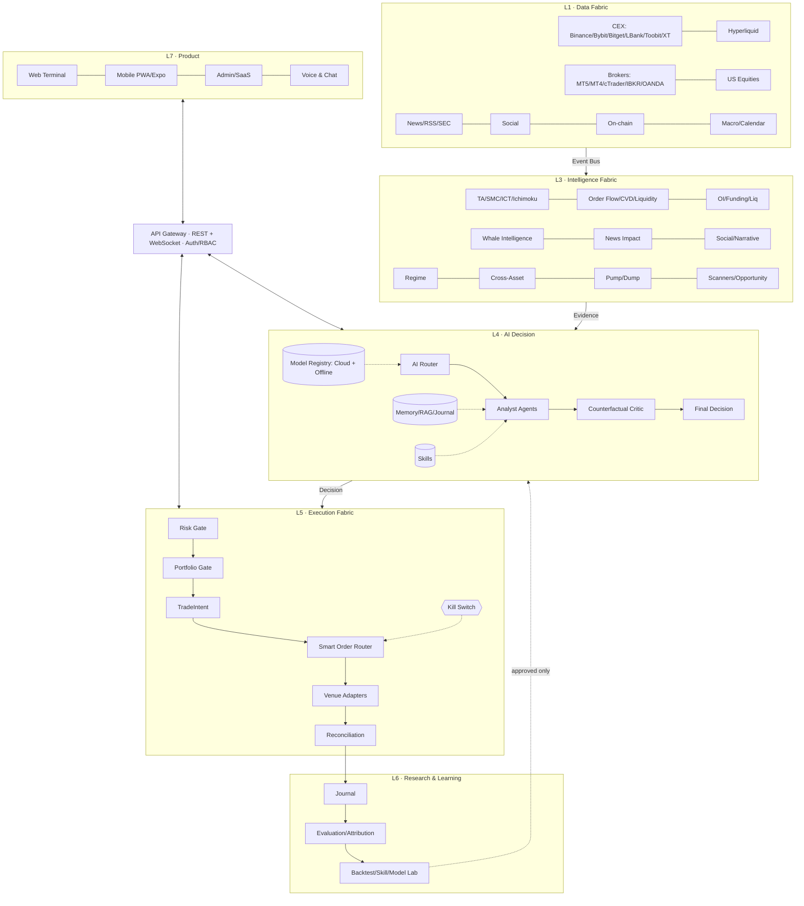
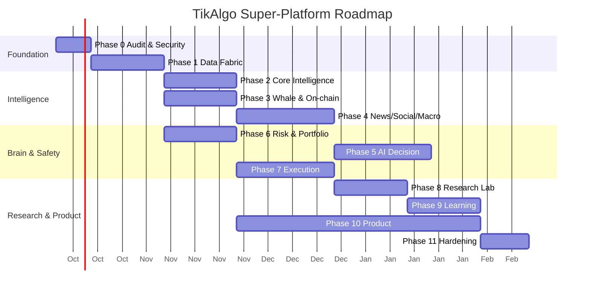

# TikAlgo — Market Operating System
## نقشه‌ی جامع ابرپروژه: معماری، ماژول‌ها، منابع متن‌باز، مدیریت پروژه و نقشه‌ی راه

> **نسخه:** 2.0 (ادغام Master Plan v1 و Super Project Architecture 2026-10-05)
> **دامنه:** Crypto · Forex · US Equities · Metals · Macro · On-chain · News/Social · AI · Paper/Live Trading
> **سایت:** `tikalgoai.com`
> **پرامپت اجرایی جامع:** [`TIKALGO_MASTER_PROMPT.md`](./TIKALGO_MASTER_PROMPT.md)

---

## فهرست

**بخش A — چشم‌انداز و قوانین**
1. [مأموریت](#1)
2. [اصول غیرقابل مذاکره](#2)
3. [سیاست معامله‌ی خودمختار](#3)

**بخش B — معماری**
4. [معماری کلان (نمودار)](#4)
5. [قراردادهای داده و Event Bus](#5)
6. [ذخیره‌سازی](#6)
7. [پشته‌ی فناوری](#7)

**بخش C — ماژول‌ها (M01 تا M50)**
8. [Data Fabric](#8)
9. [Intelligence Fabric](#9)
10. [AI Decision System](#10)
11. [Execution Fabric و Risk](#11)
12. [Research Lab و Learning](#12)
13. [Product و SaaS](#13)

**بخش D — اجرا**
14. [مدیریت پروژه: Graphify، UI/UX Pro Max، بُردها و Gateها](#14)
15. [نقشه‌ی راه و اولویت‌ها (نمودار Gantt)](#15)
16. [Definition of Done](#16)
17. [امنیت](#17)
18. [مشاهده‌پذیری](#18)

**بخش E — منابع**
19. [پروژه‌ها و اسکیل‌های گیت‌هاب، دستور نصب و لایسنس](#19)
20. [چک‌لیست ورود کد بیرونی و رجیستری اسکیل](#20)
21. [ریسک‌ها و نکات حقوقی](#21)
22. [معیارهای موفقیت](#22)

---

# بخش A — چشم‌انداز و قوانین

<a id="1"></a>
## 1. مأموریت

TikAlgo از یک ترمینال معاملاتی به یک **Universal Financial Intelligence & Autonomous Trading Platform** تبدیل می‌شود، یعنی یک «سیستم‌عامل بازار» که:

- همه‌ی بازارهای Crypto، Forex، سهام آمریکا و فلزات را در **یک ترمینال** پوشش دهد
- داده‌ی زنده و تاریخی را از صرافی‌ها، بروکرها، MT4/MT5، آن‌چین، اخبار و شبکه‌های اجتماعی جمع کند
- اخبار، احساسات، اقتصاد کلان، order flow، نقدینگی، OI، فاندینگ، CVD، لیکوییدیشن‌ها، نهنگ‌ها و تحلیل تکنیکال/SMC/ICT را در **یک مدل بازار** ترکیب کند
- برای هر نماد **Market Regime** و **Opportunity/Risk Score** بسازد
- با هوش مصنوعی کل بازار را بدون محدودیت به کوین یا تایم‌فریم ثابت اسکن کند و فرصت‌ها را رتبه‌بندی کند
- قبل از هر تصمیم از همه‌ی شواهد، Risk Engine، پرتفوی، ژورنال و وضعیت حساب استفاده کند
- **PAPER و LIVE را کاملاً جدا** نگه دارد
- به کاربر اجازه دهد مدل AI، استراتژی، اندیکاتور، اسکیل و منبع داده اضافه یا تعویض کند
- از ژورنال و ارزیابی‌ها **یاد بگیرد**، اما **هیچ مدلی را خودکار در production عوض نکند**
- برای مبتدی ساده و برای حرفه‌ای کامل باشد: وب، موبایل، صدا و چت

> حالت نهایی «یک ربات ترید» نیست. **یک حلقه‌ی کنترل‌شده** است که داده، هوش، AI، ریسک، اجرا و یادگیری را به هم وصل می‌کند.

<a id="2"></a>
## 2. اصول غیرقابل مذاکره

| # | اصل | توضیح |
|---|---|---|
| P1 | **Existing-first** | هسته‌ی موجود TikAlgo حفظ می‌شود. بازنویسی موازی یا معماری «اسباب‌بازی» ممنوع است. ماژول‌های فعلی مثل exit_advisor، billing، notifications، on-chain، reports، settings، Kill Zones و llm_engine **توسعه داده می‌شوند**. |
| P2 | **جداسازی لایه‌ها** | `DATA → NORMALIZATION → FEATURE/INTELLIGENCE → SCANNER → SIGNAL → AI DECISION → RISK → PORTFOLIO → TRADE INTENT → EXECUTION → RECONCILIATION → JOURNAL/LEARNING` |
| P3 | **ایزوله بودن PAPER و LIVE** | PAPER هرگز سفارش واقعی ارسال نمی‌کند. کلیدها و حساب‌های PAPER و LIVE جدا هستند. |
| P4 | **AI مستقیم معامله نمی‌کند** | AI، News، Whale، Scanner و Strategy فقط `Signal`، `Decision` یا `TradeIntent` تولید می‌کنند. فقط Execution Gateway سفارش می‌فرستد. |
| P5 | **Evidence-first** | هر تصمیم این‌ها را ثبت می‌کند: داده‌های استفاده‌شده، زمان داده، confidence، سیگنال‌های متناقض، وضعیت ریسک، دلیل ورود/خروج/صبر، نسخه‌ی مدل و نسخه‌ی اسکیل یا استراتژی. |
| P6 | **Non-repainting و Leakage-safe** | همه‌ی featureها، سیگنال‌ها و بک‌تست‌ها با timestamp درست ساخته می‌شوند و نگاه به آینده ندارند. |
| P7 | **Plugin-first** | استراتژی، اندیکاتور، اسکیل، Data Provider، کانکتور و مدل AI همه پلاگین و نسخه‌دار هستند. |
| P8 | **ارزیابی قبل از اعتماد** | `backtest → walk-forward → paper → approval → live` |
| P9 | **License-safe** | کد بیرونی بدون بررسی لایسنس وارد هسته نمی‌شود. MIT و Apache-2.0 ترجیح دارند. LGPL، GPL و AGPL فقط به‌صورت ایزوله و با بررسی حقوقی. |
| P10 | **Feature Flag** | هر ماژول جدید پشت یک flag است و پیش‌فرض آن خاموش است. LIVE پیش‌فرض خاموش است. |
| P11 | **بدون داده‌ی ساختگی** | Mock data یا ادعای «آماده‌ی production» بدون تست end-to-end ممنوع است. |
| P12 | **زیرساخت فقط با نیاز اندازه‌گیری‌شده** | دیتابیس یا سرویس جدید فقط وقتی اضافه می‌شود که بار واقعی آن را لازم کند. |

<a id="3"></a>
## 3. سیاست معامله‌ی خودمختار

**AI می‌تواند انتخاب کند:** نماد، صرافی یا بروکر، جهت، تایم‌فریم، استراتژی، ورود، خروج، اندازه‌ی پوزیشن، اهرم، TP، SL، Trailing، و صبر یا نگه‌داشتن.

**AI باید رعایت کند (بدون استثنا):** Risk Engine، سقف‌های پرتفوی و حساب، قابلیت‌های صرافی، تازگی داده، ساعات بازار، محدودیت‌های اجرا و Kill Switch.

**سطوح خودمختاری (برای هر کاربر یا استراتژی):**

| سطح | رفتار | پیش‌فرض |
|---|---|---|
| `advisory` | فقط پیشنهاد با توضیح | ✅ برای همه |
| `paper` | اجرای خودکار روی حساب کاغذی | |
| `semi-auto` | اجرا بعد از تأیید کاربر | |
| `auto` | اجرای خودکار با سقف‌های سخت | فقط با تأیید صریح، آزمون ریسک و سقف کم |

**خروجی‌های مجاز تصمیم:** `BUY · SELL · WAIT · EXIT · REDUCE · ADD · MOVE_SL · TAKE_PROFIT · NO_ACTION`

---

# بخش B — معماری

<a id="4"></a>
## 4. معماری کلان



### حلقه‌ی اصلی
```
Ingest → Normalize → Event Bus → Features → Scanners/Signals → AI Decision (+ Critic)
→ Risk Gate (veto) → Portfolio Gate → TradeIntent → Execution → Fill → Reconciliation
→ Journal → Attribution → Evaluation → (offline) Skill/Model Lab → Approval → Production
```

<a id="5"></a>
## 5. قراردادهای داده و Event Bus

### 5.1 Envelope استاندارد رویدادها
```json
{
  "event_id": "uuid",
  "event_type": "market.trade",
  "source": "binance",
  "symbol": "BTCUSDT",
  "asset_class": "crypto",
  "timestamp": "2026-10-05T12:00:00.123Z",
  "ingested_at": "2026-10-05T12:00:00.140Z",
  "sequence": 123,
  "payload": {},
  "schema_version": 1
}
```

### 5.2 خانواده‌ی رویدادها
`market.*` · `orderbook.*` · `trade.*` · `ohlcv.*` · `funding.*` · `oi.*` · `liquidation.*` · `whale.*` · `onchain.*` · `news.*` · `social.*` · `macro.*` · `regime.*` · `scanner.*` · `signal.*` · `decision.*` · `risk.*` · `intent.*` · `order.*` · `fill.*` · `position.*` · `journal.*` · `alert.*` · `system.*`

### 5.3 قراردادهای کانونی (همه نسخه‌دار)
`Instrument` · `Venue` · `VenueCapabilities` · `MarketTick` · `Candle` · `OrderBook` · `Trade` · `Funding` · `OpenInterest` · `Liquidation` · `WhaleEvent` · `WalletPosition` · `OnchainTransfer` · `NewsEvent` · `SocialEvent` · `MacroEvent` · `FeatureVector` · `MarketRegime` · `Opportunity` · `Signal` · `AIDecision` · `RiskDecision` · `TradeIntent` · `Order` · `Fill` · `Position` · `JournalEntry`

### 5.4 قابلیت‌های هر Venue (صریح)
```json
{ "spot": true, "futures": true, "ticker": true, "orderbook": true, "trades": true,
  "ohlcv": true, "funding": true, "open_interest": true, "liquidations": true,
  "orders": true, "positions": true, "reduce_only": true, "post_only": true }
```
> صرافی‌ای که فقط در جدول دیتابیس هست «قابل معامله» نیست. قابلیت‌ها باید با تست واقعی تأیید شوند.

### 5.5 Feature Vector هوش مصنوعی
```yaml
market:          [price, returns, volatility, trend]
microstructure:  [spread, imbalance, delta, cvd, liquidity]
derivatives:     [oi, oi_delta, funding, liquidations, basis]
technical:       [rsi, adx, atr, ichimoku, smc, ict]
whale:           [whale_score, net_position_change, large_transfer_flow]
news:            [sentiment, novelty, impact, credibility]
social:          [sentiment, velocity, narrative_score, manipulation_score]
macro:           [dxy, yields, vix, gold, oil, regime]
portfolio:       [exposure, drawdown, risk, correlations]
journal:         [similar_setup_score, historical_expectancy]
```

<a id="6"></a>
## 6. ذخیره‌سازی

| لایه | کاربرد |
|---|---|
| **PostgreSQL** (منبع حقیقت) | users، accounts، orders، fills، positions، journal، strategies، skills، models، news، social، whales، wallet_positions، macro، signals، decisions و audit |
| **TimescaleDB** (افزونه‌ی همان Postgres) | candles، trades، funding، oi و features، با hypertable و continuous aggregates |
| **pgvector** (افزونه‌ی همان Postgres) | embedding خبرها، ژورنال، درس‌ها و اسکیل‌ها (RAG) |
| **Redis** | کش لحظه‌ای، Pub/Sub، **Redis Streams** به‌عنوان Event Bus (فاز B)، پخش WebSocket، rate limit و هماهنگی jobها |
| **Object Storage (MinIO/S3)** | خبرهای خام، دیتاست‌ها، نتایج بک‌تست، مدل‌ها و گزارش‌ها |

> دیتابیس جدید فقط وقتی اضافه شود که اندازه‌گیری نشان دهد لازم است. اول همه‌چیز در Postgres + Timescale + pgvector.

<a id="7"></a>
## 7. پشته‌ی فناوری

| حوزه | انتخاب | یادداشت |
|---|---|---|
| Backend | Python 3.12 + FastAPI + Pydantic v2 | مطابق کد موجود تطبیق داده شود |
| Workers | Celery/Arq + Redis | |
| Event Bus | Redis Streams | NATS یا Kafka فقط با نیاز اندازه‌گیری‌شده |
| Frontend | Next.js + TypeScript + Tailwind + shadcn/ui | طراحی با **UI/UX Pro Max** |
| Mobile | **PWA اول**، بعد Expo (React Native) | نوار پایین ثابت |
| Chart | **TradingView Lightweight Charts** (Apache-2.0، با attribution) یا KLineChart (Apache-2.0) | |
| LLM ابری | Claude / OpenRouter | |
| LLM آفلاین | Ollama · llama.cpp · vLLM | پشت **Local Model Gateway** |
| ML | LightGBM · scikit-learn · hmmlearn · PyTorch | |
| Research | vectorbt · Qlib · LEAN (ایزوله) | |
| MLOps | MLflow | Model Registry |
| Voice | Pipecat / LiveKit Agents + Whisper + TTS | |
| Observability | Prometheus · Grafana · Loki · Sentry · OpenTelemetry | |
| Infra | Docker Compose ← K3s (در صورت نیاز) | |
| Code intelligence | **Graphify** | گراف دانش کد برای مدیریت پروژه |

---

# بخش C — ماژول‌ها

> قالب هر ماژول: **هدف · قابلیت‌ها · خروجی · مراجع**. شناسه‌ها (M01 تا M50) در Gap Matrix و بُرد پروژه استفاده می‌شوند.

<a id="8"></a>
## 8. Data Fabric (L1)

### M01 · Crypto Market Data Hub
- **Venueها:** Binance، Bybit، Bitget، LBank، Toobit، XT.com، Hyperliquid، OKX، و بقیه از طریق Connector Interface
- **Interface:** `MarketDataProvider · AccountProvider · OrderProvider · PositionProvider · FundingProvider · OpenInterestProvider · LiquidationProvider · WebSocketProvider · HealthProvider`
- **قابلیت‌ها:** WebSocket برای tick، orderbook و trades؛ backfill کندل؛ تشخیص گپ (C1، انجام شده)؛ **staleness watchdog** (برای حل `runtime_stale`)؛ نرمال‌سازی نماد
- **قاعده:** اگر API اختصاصی صرافی اطلاعات بیشتری می‌دهد، از آن استفاده کنید؛ CCXT جایگزین API اختصاصی نیست.
- **مراجع:** [ccxt](https://github.com/ccxt/ccxt) · [hyperliquid-python-sdk](https://github.com/hyperliquid-dex/hyperliquid-python-sdk) · [agent-kit (Toobit)](https://github.com/cryptojs7-eng/agent-kit) · [hummingbot connectors](https://github.com/hummingbot/hummingbot)

### M02 · Derivatives Data
- OI، OI delta، فاندینگ، Basis، لیکوییدیشن‌ها (مثلاً Binance `forceOrder`)، نسبت Long/Short و واگرایی قیمت و OI

### M03 · Broker Hub (Forex / Metals / Indices)
- **اتصال‌ها:** MT5، پل MT4، FIX، cTrader، IBKR، OANDA و بروکرهای بعدی
- **نرمال‌سازی:** نماد، bid/ask، اسپرد، tick، lot size، contract size، مارجین، اهرم، ساعات معامله، سواپ، کمیسیون، انواع سفارش و حالت پوزیشن
- **مراجع:** [mt5linux](https://github.com/tiloye/mt5linux) · [MT5 DataBridge (Docker)](https://github.com/DeadSecure/Dockerized-MetaTrader5-with-Python-DataBridge) · [Metatrader5-Docker](https://github.com/django-trader/Metatrader5-Docker) · [oandapyV20](https://github.com/hootnot/oanda-api-v20) · [vn.py gateways](https://github.com/vnpy/vnpy)

### M04 · US Equities
- Alpaca، IBKR و yfinance (تاریخی)؛ گزارش‌های درآمد، SEC Filings و Corporate Actions
- **مراجع:** [alpaca-py](https://github.com/alpacahq/alpaca-py) · [ib_async](https://github.com/ib-api-reloaded/ib_async) · [yfinance](https://github.com/ranaroussi/yfinance)

### M05 · News Ingestion
- **منابع:** بلاگ رسمی پروژه‌ها، اطلاعیه‌های صرافی‌ها (لیست و دی‌لیست)، IR شرکت‌ها، SEC، بانک‌های مرکزی، داده‌های دولتی، RSS و خبرگزاری‌های معتبر مالی و کریپتو، و GitHub releases پروژه‌ها
- **مراجع:** [cryptocurrency.cv](https://gittrend.io/repo/nirholas/cryptocurrency.cv) · [cryptopanic client](https://github.com/roccomuso/cryptopanic) · [Crawl4AI](https://github.com/unclecode/crawl4ai) (فقط برای منابع مجاز) · `feedparser`

### M06 · Social Ingestion
- **منابع (فقط API یا منابع مجاز):** X (API رسمی)، Reddit، کانال‌های عمومی Telegram، Discord عمومی، YouTube، فعالیت GitHub پروژه‌ها و Google Trends
- **مراجع:** `praw` · `telethon` · `pytrends` · [Vibe-Trading social-media-intelligence](https://tessl.io/registry/skills/github/HKUDS/Vibe-Trading/social-media-intelligence)

### M07 · On-chain & Large Transfers
- ورود و خروج صرافی‌ها، جریان استیبل‌کوین‌ها، تراکنش‌های بزرگ کیف‌پول، Mint/Burn، Bridge Flow، جریان بین CEX و DEX، و تمرکز هولدرها
- **منابع:** Whale Alert، خانواده‌ی Etherscan، DefiLlama، Dune، Arkham/Nansen (پولی)
- **مراجع:** [web3.py](https://github.com/ethereum/web3.py) · [monitoring-whale-activity skill](https://claudeskills.info/skills/jeremylongshore/claude-code-plugins-plus-skills/monitoring-whale-activity/) · [whale-alert-monitor skill](https://claudeskills.info/skills/aAAaqwq/AGI-Super-Team/whale-alert-monitor/)
- **نکته:** ماژول on-chain موجود را توسعه دهید.

### M08 · Hyperliquid Data & Whale Feed 🐋
- **API:** `POST https://api.hyperliquid.xyz/info` (`clearinghouseState`، leaderboard و userFills) و `wss://api.hyperliquid.xyz/ws`
- **مراجع:** [hyperliquid-python-sdk (MIT)](https://github.com/hyperliquid-dex/hyperliquid-python-sdk) · [hyperliquid-rust-sdk](https://github.com/hyperliquid-dex/hyperliquid-rust-sdk) · [order_book_server](https://github.com/hyperliquid-dex/order_book_server) · [راهنمای Dwellir](https://www.dwellir.com/guides/hyperliquid-whale-tracking) · [Chainstack](https://chainstack.com/hyperliquid-on-chain-activity-tracker-build-your-own-telegram-bot/amp/)

### M09 · Macro & Economic Calendar
- **ورودی‌ها:** CPI، PPI، NFP، FOMC، ECB/BoE/BoJ، بیکاری، GDP و PMI؛ FRED (نرخ‌ها، بازده اوراق ۲ و ۱۰ ساله، M2)؛ و **Surprise Score**
- **مراجع:** [OpenBB](https://github.com/OpenBB-finance/OpenBB) · [fredapi](https://github.com/mortada/fredapi) · [forex-factory-scarping](https://github.com/tchala120/forex-factory-scarping)

### M10 · Data Platform & Event Bus
- Event Bus روی Redis Streams با consumer group، retry و dead-letter؛ Timescale؛ pgvector؛ و Feature Store

<a id="9"></a>
## 9. Intelligence Fabric (L3)

### M11 · Technical Engine
- بیش از ۱۵۰ اندیکاتور، چند تایم‌فریمی، الگوهای کندلی و نموداری، ایچیموکو (✅ در agent-kit)، ADX، ATR، Volume Profile و VWAP
- **مراجع:** [TA-Lib](https://github.com/TA-Lib/ta-lib-python) · [pandas-ta](https://github.com/twopirllc/pandas-ta) · [stock-pattern](https://github.com/BennyThadikaran/stock-pattern)

### M12 · SMC / ICT Engine
- BOS، CHoCH، Order Block، FVG، شکار نقدینگی، Premium/Discount و **Kill Zones (C5)**
- **مراجع:** [smart-money-concepts](https://github.com/joshyattridge/smart-money-concepts) · [OpenMobius-skill](https://agentskill.work/en/skills/MobiusQuant/OpenMobius-skill)

### M13 · Market Microstructure & Order Flow
- Orderbook، DOM، Footprint، Delta، CVD، دیوارهای نقدینگی، Absorption و Spoofing، عدم تعادل Bid/Ask و طبقه‌بندی طرف تهاجمی معامله (aggressor)

### M14 · Derivatives Intelligence
- OI delta، Funding extremes، خوشه‌های لیکوییدیشن، واگرایی OI و قیمت، و تشخیص squeeze

### M15 · Whale & Smart-Money Intelligence 🐋
**Pipeline:**
```
Hyperliquid WS/API → Wallet Discovery → Normalizer → Position Snapshot → Position Delta
→ Entry/Exit Detection → Liquidation/Funding Context → Wallet Scoring → Smart-Money Clustering
→ Market Impact → AI Evidence
```
- **ردیابی:** ۱۰۰ تا ۵۰۰ کیف‌پول ارزشمند و بیشتر؛ اندازه، اهرم، قیمت ورود و لیکوییدیشن، PnL، واریز و برداشت، تغییرات پوزیشن، رفتار سودآور تکراری، انباشت و توزیع، و کیف‌پول‌های همبسته
- **امتیاز نهنگ:** `WhaleScore = profitability + consistency + size + timing + market_impact + historical_accuracy − manipulation_risk`
- **قاعده:** فعالیت نهنگ **هرگز به‌تنهایی** ماشه‌ی معامله نیست و باید با ساختار بازار، نقدینگی، OI/فاندینگ و ریسک تأیید شود.
- **خروجی:** `whale.position`، `whale.score` و **Whale Pressure Index** برای هر نماد

### M16 · News Intelligence & Event Impact 📰
**Pipeline:**
```
Source → Dedup → Entity Extraction → Symbol Mapping → Event Classification → Sentiment
→ Novelty → Credibility → Market Impact → Horizon → Confidence → Cross-Asset Mapping
```
- **Schema:** `event_id, timestamp, source, headline, content_hash, entities, symbols, asset_class, event_type, sentiment, novelty, credibility, expected_impact, actual_market_reaction, horizon, confidence`
- **Event Impact Engine:** برای هر رویداد مهم، جهت مورد انتظار، دارایی‌ها، بخش‌ها، ارزها و کالاهای متأثر، نمونه‌های مشابه تاریخی، **واکنش واقعی بازار** و **تحلیل بعد از رویداد** ثبت می‌شود. این داده اساس یادگیری است.
- خبر فقط احساسات نیست: سیستم باید اثر خبر را بر BTC، ETH، USD، طلا، نفت، Nasdaq، سهام منفرد و کل رژیم risk-on یا risk-off تشخیص دهد.
- **مراجع:** [FinBERT (Apache-2.0)](https://github.com/ProsusAI/finBERT) · [FinBERT-yya518](https://github.com/yya518/FinBERT) · [FinGPT](https://github.com/AI4Finance-Foundation/FinGPT)

### M17 · Social, Trend & Narrative Intelligence
**Pipeline:**
```
Posts → Spam/Bot Filter → Entity/Symbol → Sentiment → Emotion → Narrative → Velocity
→ Engagement Quality → Influencer Weight → Manipulation Score → Trend Score
```
- **روایت‌ها:** AI، RWA، DePIN، L2، Meme، ETF، قانون‌گذاری، کاهش نرخ بهره، تورم، ژئوپلیتیک، انرژی و نقدینگی، همراه با **نگاشت هر روایت به دارایی‌های متأثر**

### M18 · Macro Intelligence
- **ورودی‌ها:** BTC، ETH، ETH/BTC، دامیننس BTC، عرضه‌ی استیبل‌کوین‌ها، DXY، بازده ۲ و ۱۰ ساله، VIX، S&P500، Nasdaq، طلا، نفت و شاخص‌های اعتبار و نقدینگی
- **خروجی:** `Risk-On / Risk-Off / Inflationary / Disinflationary / Liquidity Expansion / Contraction / Crypto Bull / Bear / USD Strong / Weak / Gold Bull / Bear / Equity Risk`

### M19 · Cross-Asset Intelligence
- **نمونه‌ی روابط:** DXY↑ ← فشار روی طلا، BTC و سهام · US10Y↑ ← فشار روی دارایی‌های ریسکی · VIX↑ ← احتمال risk-off · نفت↑ ← انتظارات تورمی · BTC.D↑ ← ضعف نسبی آلت‌کوین‌ها · رشد عرضه‌ی استیبل‌کوین ← گسترش نقدینگی
- **قاعده:** این روابط ثابت نیستند. **وابسته به رژیم‌اند** و باید با داده‌ی تاریخی سنجیده شوند (همبستگی پویا و Lead/Lag).

### M20 · Market Regime Engine
- **شواهد ترکیبی:** روند، نوسان، نقدینگی، Macro، اعتبار، مشتقات، Breadth، Cross-asset، احساسات و آن‌چین
- **روش:** HMM و Change-point همراه با قواعد
- **خروجی:** `regime, confidence, drivers, invalidators, expected_behavior, recommended_strategy_families` و **Strategy Router** که رژیم را به استراتژی‌های مناسب نگاشت می‌کند
- **مراجع:** [market-regime-detection](https://github.com/Sakeeb91/market-regime-detection) · `hmmlearn` · `ruptures`

### M21 · Pump/Dump Engine 🚀
- **تشخیص:** شتاب قیمت، ناهنجاری حجم، تغییر نقدینگی، سرعت شبکه‌های اجتماعی، تمرکز کیف‌پول‌ها، جریان صرافی‌ها، عدم تعادل اوردربوک، OI و فاندینگ، و معاملات بزرگ
- **طبقه‌بندی:** `organic breakout · short squeeze · long squeeze · news breakout · whale accumulation · manipulation suspicion · low-liquidity spike`
- هر حرکت سریعی پامپ نیست.
- **مرجع:** [Pump & Dump Detector (منطق)](https://www.tradingview.com/script/8a3t8MfR-pump-dump-detector-sensitive)

### M22 · Market Scanner & Opportunity Scoring
- **انواع اسکنر:**
  - **تکنیکال:** روند، شکست، برگشت، مومنتوم، نوسان، SMC/ICT، ایچیموکو، ADX، ATR، RSI و حجم
  - **جریان:** CVD، OI، فاندینگ، لیکوییدیشن، نهنگ و اوردربوک
  - **AI:** احتمال، Expected Value، ریسک و کاتالیزور
  - **فاندامنتال:** درآمد، ارزش‌گذاری، توکنومیکس، فعالیت پروژه، Unlockها، خزانه و ETF
  - **Pump Hunter**
- **خروجی:** `OpportunityScore, Confidence, Direction, EntryZone, Invalidation, Targets, RiskReward, Catalysts, Evidence, Expiry`
- **Rule Builder** برای ساخت اسکنر بدون کدنویسی

<a id="10"></a>
## 10. AI Decision System (L4)

### M23 · AI Router & Analyst Agents
```
AI Router
 ├── Market Analyst        ├── Whale Analyst         ├── Fundamental Analyst
 ├── Technical Analyst     ├── News Analyst          ├── Risk Analyst
 ├── SMC/ICT Analyst       ├── Social Analyst        ├── Portfolio Analyst
 ├── Order Flow Analyst    ├── Macro Analyst         ├── Counterfactual Critic
 └──────────────────────────────────────────────────── Final Decision Agent
```
- **زمینه‌ی اجباری هر تصمیم:** داده‌ی جاری، featureهای چند تایم‌فریمی، اخبار، شبکه‌های اجتماعی، نهنگ‌ها، آن‌چین، Macro، رژیم، پوزیشن‌های باز، Equity، اکسپوژر، همبستگی، **درس‌های ژورنال**، عملکرد استراتژی، confidence مدل و محدودیت‌های اجرا
- **Decision Trace و Evidence Graph:** هر تصمیم یک گراف شواهد قابل نمایش برای کاربر دارد
- **الگوها:** [TradingAgents](https://github.com/TauricResearch/TradingAgents) · [ai-hedge-fund](https://github.com/virattt/ai-hedge-fund) · [FinRobot](https://github.com/AI4Finance-Foundation/FinRobot)
- `llm_engine.py` موجود به این Router وصل می‌شود.

### M24 · Signal Fusion & Calibration
- ترکیب وزن‌دار و وابسته به رژیم همه‌ی شواهد، و **کالیبراسیون confidence** روی نتایج ژورنال (Isotonic/Platt)

### M25 · Memory, RAG & Journal Learning 🧠
- حافظه‌ی لایه‌ای به سبک [FinMem](https://arxiv.org/pdf/2311.13743)، و **بازیابی موقعیت‌های مشابه گذشته قبل از هر تصمیم**
- **چرخه‌ی یادگیری کنترل‌شده (بدون تغییر خودکار در production):**
```
Trade → Outcome → Journal → Attribution → Evaluation Dataset → Offline Training
→ Backtest → Walk-Forward → Paper → Approval → Production
```

### M26 · Offline AI & Model Registry
```
Local Model Gateway ── Ollama ── llama.cpp ── vLLM (در صورت وجود GPU) ── local embeddings
```
- **Model Registry:** `model_id, provider, version, quantization, context, capabilities, latency, cost, benchmark, active`
- مدل AI قابل تعویض است **بدون تغییر منطق معامله**. Router وظایف سبک را به مدل محلی و تحلیل عمیق را به مدل ابری می‌فرستد.
- **مراجع:** [Ollama](https://github.com/ollama/ollama) · [llama.cpp](https://github.com/ggml-org/llama.cpp) · [vLLM](https://github.com/vllm-project/vllm) · [MLflow](https://github.com/mlflow/mlflow) · [Qlib](https://github.com/microsoft/qlib) · [FinRL](https://github.com/AI4Finance-Foundation/FinRL)

### M27 · Skills System 🧩
```
skills/
  market-regime/  whale-analysis/  hyperliquid/  news-impact/  social-sentiment/
  smc-ict/  ichimoku/  wyckoff/  order-flow/  risk-management/  portfolio-management/
  macro-analysis/  pump-dump/  backtesting/  execution/  broker-mt5/
```
- **ساختار هر اسکیل:** `SKILL.md · manifest.json · prompts/ · tools/ · tests/ · examples/ · version · license`
- **Manifest با مجوزهای صریح:**
```json
{ "name": "hyperliquid-whale-intelligence", "version": "1.0.0",
  "permissions": ["market.read", "wallet.read", "position.read"],
  "can_trade": false, "license": "MIT" }
```
- **مجوز معامله کاملاً جدا از مجوز تحلیل است.**
- **رجیستری:** نصب، فعال یا غیرفعال کردن، pin کردن نسخه، محدوده‌ی مجوز، منبع، ممیزی، rollback و تست قبل از فعال‌سازی (بخش ۲۰)

### M28 · AI Assistants
| دستیار | کار |
|---|---|
| 🚀 Pump Hunter | رتبه‌بندی لحظه‌ای کاندیداها بر اساس M21 |
| 📡 Signal Assistant | سیگنال با شواهد، confidence و ریسک |
| 🤖 AI Trader & Position Manager | مدیریت پوزیشن‌ها؛ توسعه‌ی **exit_advisor** موجود |
| 💬 Chat Analyst | دستورهایی مثل: analyze BTC · scan market · explain signal/position/loss · find whale activity · compare assets · run backtest · optimize strategy · show regime |
| 🎙 Voice Tutor | آموزش صوتی، Onboarding و راهنمای متنی (M46) |

<a id="11"></a>
## 11. Execution Fabric و Risk (L5)

### M29 · Exchange & Broker Adapters
- همه‌ی Venueهای M01 و M03 با رابط واحد `place_order · cancel · amend · positions · balances · stream_fills · health`
- **اولویت:** **LBank Futures (مسیر کامل live)** · **Hyperliquid live + reconciliation** · Binance و Bybit · MT5
- انواع سفارش: market، limit، stop، stop-limit، TP، SL، trailing، reduce-only، post-only و bracket

### M30 · Smart Order Router
```
TradeIntent → RiskGate → PortfolioGate → VenueSelector → SmartExecutionRouter → Order → Fill → Reconciliation
```
- انتخاب Venue بر اساس نقدینگی، اسپرد، کارمزد، تأخیر، قابلیت اطمینان، مارجین آزاد، فاندینگ و کیفیت اجرا

### M31 · Risk Engine 🛡 (حق وتوی مطلق)
- **بررسی‌ها:** ریسک حساب، ضرر روزانه، ضرر هفتگی، Max Drawdown، اکسپوژر نماد، بخش و کلاس دارایی، همبستگی، اهرم، مارجین، فاصله تا لیکوییدیشن، اسپرد، لغزش، ریسک خبر و رویداد، و تمرکز پرتفوی
- **Kill Switch سخت:** دستی، خودکار، قطع اتصال صرافی، قیمت غیرعادی، داده‌ی stale، حلقه‌ی سفارش بی‌پایان، عدم تطابق reconciliation و عبور از سقف ضرر روزانه

### M32 · Portfolio & Capital Manager (فاز E)
```
User ├── Crypto accounts ├── Broker accounts ├── MT5 accounts ├── Paper accounts └── Strategy portfolios
```
- نمای تجمیعی Equity، PnL، اکسپوژر، اهرم، نقد، مارجین، ریسک، همبستگی و Drawdown
- تخصیص سرمایه به استراتژی‌ها؛ اندازه‌ی پوزیشن پویا (Kelly کسری یا Vol-target)

### M33 · Reconciliation
- تطبیق مداوم سفارش‌ها، پوزیشن‌ها و موجودی داخلی با صرافی یا بروکر؛ هر عدم تطابق Kill Switch را فعال می‌کند و هشدار می‌دهد.

### M34 · Bots Manager
- ربات‌های داخلی (Grid، DCA، Trend و Breakout) و ربات‌های مبتنی بر اسکیل
- **EAهای متاتریدر:** آپلود، اجرا و پایش، همراه با **پایش اسپرد**
- **مراجع:** [freqtrade](https://github.com/freqtrade/freqtrade) · [hummingbot](https://github.com/hummingbot/hummingbot) · [EA31337](https://github.com/EA31337/EA31337)

<a id="12"></a>
## 12. Research Lab و Learning (L6)

### M35 · Strategy & Indicator SDK
```text
Strategy:  metadata · parameters · required_features · entry() · exit() · risk() · position_sizing()
Indicator: inputs · timeframe · calculate() · outputs · warmup · non_repaint
```
- استراتژی‌های داخلی، الهام‌گرفته از Pine، پایتونی، AI، ترکیبی و پرتفوی چنداستراتژی؛ و **No-code Builder**

### M36 · Backtest & Research Lab 🧪
- **لازم:** replay تاریخی در سطح tick، دقیقه و روز؛ کارمزد، اسپرد، لغزش، فاندینگ، تأخیر و پر شدن جزئی سفارش؛ لیکوییدیشن؛ مارجین؛ ساعات بازار؛ corporate actions؛ walk-forward؛ Monte Carlo؛ تحلیل حساسیت؛ out-of-sample؛ مقایسه با بنچمارک
- **معیارها:** CAGR، Sharpe، Sortino، Calmar، MaxDD، Win Rate، Expectancy، Profit Factor، گردش، اکسپوژر، VaR/CVaR و Tail Loss
- **قاعده:** هیچ‌وقت فقط روی سود خالص بهینه‌سازی نکنید.
- **مراجع:** [vectorbt](https://github.com/polakowo/vectorbt) · [LEAN](https://github.com/QuantConnect/Lean) (ایزوله) · [backtesting.py](https://github.com/kernc/backtesting.py) · [Optuna](https://github.com/optuna/optuna)

### M37 · Optimizer & Module Test Harness
- Optuna با محافظ walk-forward؛ Market Replay برای تست هر ماژول؛ Paper Trading روی همان مسیر OMS و Risk

### M38 · Journal 📓
- **ژورنال تغییرناپذیر برای هر تصمیم و معامله:** تز، شواهد، ورود، خروج، مدل، استراتژی، نسخه‌ی اسکیل، ریسک، رژیم، اخبار، وضعیت نهنگ‌ها و شبکه‌های اجتماعی، نتیجه، MFE/MAE، اشتباهات و درس‌ها
- ثبت خودکار، اسکرین‌شات نمودار و برچسب احساسی کاربر

### M39 · Evaluation & Promotion Pipeline
- Attribution (کدام شاهد درست یا غلط بود)، دیتاست ارزیابی، بنچمارک مدل‌ها و اسکیل‌ها، و **ارتقای کنترل‌شده از paper به live با تأیید انسانی**

<a id="13"></a>
## 13. Product و SaaS (L7)

### M40 · Advanced Chart Terminal
- **TradingView Lightweight Charts** (Apache-2.0، attribution الزامی) یا KLineChart
- کندل، خط، ناحیه، حجم، چند پنل، اندیکاتورها و ابزارهای ترسیم (خط روند، Ray، افقی و عمودی، فیبوناچی، مستطیل و متن)
- **Overlayها:** SMC/ICT، نقدینگی، اوردربوک، معاملات، پوزیشن‌ها، سفارش‌ها، SL/TP، هشدارها، ورود و خروج AI، خبرها، پوزیشن نهنگ‌ها و خطوط لیکوییدیشن
- **چیدمان ترمینال:** ۲ تا ۴ نمودار، واچ‌لیست، اوردربوک، Footprint، پنل AI، پوزیشن‌ها، سفارش‌ها، ریسک و شواهد سیگنال
- تب‌های بازار: `Crypto | Forex | Stocks | Metals`

### M41 · Live Search & Pro Watchlists
- Command Palette ⌘K برای همه‌ی بازارها؛ واچ‌لیست‌های چندگانه با ستون‌های سفارشی، Sparkline و هشدار

### M42 · Alerts & Notifications
- **کانال‌ها:** درون‌برنامه، Web Push، ایمیل، Telegram، Discord، Webhook و اعلان موبایل
- **رویدادها:** سیگنال، نهنگ، لیکوییدیشن، خبر، Macro، پوزیشن، عبور از سقف ریسک، اجرا و سلامت سیستم
- ماژول notifications موجود را توسعه دهید.

### M43 · Reports
- گزارش‌های مدیریتی روزانه، هفتگی و ماهانه، به تفکیک استراتژی، بازار و حساب. ماژول reports موجود را توسعه دهید.

### M44 · Admin, RBAC & SaaS
- کاربران، نقش‌ها، مجوزها، پلن‌ها، اشتراک‌ها، پرداخت‌ها، مصرف API، مدل و داده، لاگ ممیزی، سیاست‌های ریسک، سلامت سیستم، وضعیت کانکتورها، Feature Flagها و پایش سوءاستفاده
- **پلن‌ها:** Free · Pro · Advanced · Professional · Institutional

### M45 · Payments
- `PaymentProvider → Crypto (BTCPay Server / XPayLabs / NOWPayments) → future fiat`
- ماژول billing موجود را توسعه دهید.
- **مراجع:** [BTCPay Server](https://github.com/btcpayserver/btcpayserver) · [XPayLabs](https://awesome.ecosyste.ms/projects/github.com%2Fyan253319066%2FXPayLabs-docker)

### M46 · Voice Assistant 🎙
> ⚠️ **به‌روز شده:** دستیار صوتی فقط‌خواندنی، آموزشی، چندزبانه و محرمانه است. هیچ عملیات معاملاتی یا تنظیماتی انجام نمی‌دهد و معماری را فاش نمی‌کند. مشخصات کامل در بخش ۱۴ از `TIKALGO_MASTER_PROMPT.md`.
- STT و TTS، راهنمای وابسته به صفحه، Onboarding و آموزش، به فارسی و انگلیسی
- **مراجع:** [pipecat](https://github.com/pipecat-ai/pipecat) · [livekit/agents](https://github.com/livekit/agents) · [faster-whisper](https://github.com/SYSTRAN/faster-whisper)

### M47 · Community Chat
- کانال‌های کاربران با WebSocket، مدیریت محتوا و اشتراک‌گذاری تحلیل
- **مرجع:** [Centrifugo](https://github.com/centrifugal/centrifugo)

### M48 · Mobile (PWA → Expo)
- **PWA اول**؛ قراردادهای مشترک API و WebSocket؛ اعلان موبایل؛ قابلیت نصب؛ بعداً اپ native
- **صفحه‌ها:** داشبورد، پوزیشن‌ها، سیگنال‌ها، اسکنر، هشدارها، چت AI، نمودار، ریسک و سلامت حساب
- **نوار پایین ثابت:** Home · Markets · AI · Bots · Portfolio

### M49 · Public Landing & Auth
- معرفی، قیمت‌گذاری، FAQ، وبلاگ و ثبت‌نام و ورود (ایمیل، Google، 2FA و Passkey)

### M50 · Pro Settings
- ماژول settings موجود؛ حالت مبتدی و حرفه‌ای؛ Import/Export پروفایل تنظیمات

### ناوبری اصلی (دسکتاپ)
`Home · Markets · Terminal · Scanner · Signals · AI Trader · Portfolio · Positions · Journal · Backtest Lab · Strategies · Skills · AI Models · Research · News · Whales · On-chain · Macro · Alerts · Reports · Settings`

---

# بخش D — اجرا و مدیریت پروژه

<a id="14"></a>
## 14. مدیریت پروژه: Graphify، UI/UX Pro Max، بُردها و Gateها

### 14.1 Graphify: گراف دانش کد برای مدیریت پروژه 🕸
**چرا:** TikAlgo بزرگ است و بیش از ۱۴۰۰ تست دارد. Graphify کد، مستندات و PDFها را به یک **گراف دانش قابل پرس‌وجو** تبدیل می‌کند تا Claude Code قبل از هر تغییر ببیند چه چیزی به چه چیزی وابسته است، به‌جای grep کردن کورکورانه.

**نصب (روی سرور، داخل مخزن):**
```bash
uv tool install graphifyy        # نام پکیج در PyPI با دو y است؛ دستور CLI همان graphify است
# یا: pipx install graphifyy
graphify install                 # اسکیل /graphify و هوک‌های Claude Code را نصب می‌کند
```
**استفاده در مدیریت پروژه:**
- `/graphify` در Claude Code: ساخت یا به‌روزرسانی گراف کل مخزن
- قبل از هر فاز: «کدام ماژول‌ها به `risk_engine` وابسته‌اند؟»، «مسیر کامل سفارش از Decision تا Fill کجاست؟»
- خروجی گراف مبنای **`TIKALGO_ARCHITECTURE_BASELINE.md`** و **`GAP_MATRIX.md`** در فاز ۰ است
- بعد از هر فاز گراف را به‌روز کنید تا دیاگرام معماری همیشه با کد واقعی هم‌خوان بماند
- **مراجع:** [Graphify در Claude Code](https://graphify.com/integrations/claude-code) · [راهنمای Graphify](https://www.augmentcode.com/learn/graphify-knowledge-graph-codebase-skill)

> ⚠️ Graphify هوک‌هایی به Claude Code اضافه می‌کند. قبل از نصب، تنظیمات و هوک‌هایش را بخوانید.

### 14.2 UI/UX Pro Max: سیستم طراحی 🎨
**چرا:** یک سیستم طراحی یکپارچه (توکن‌های رنگ، تایپوگرافی، فاصله‌ها و کامپوننت‌ها)، قوانین مخصوص صنعت فین‌تک، تشخیص الگوهای غلط (anti-pattern) و چک‌لیست دسترس‌پذیری. این اسکیل قبلاً روی سرور نصب شده است (v2.13.0).

**نصب یا به‌روزرسانی:**
```bash
# داخل Claude Code:
/plugin marketplace add nextlevelbuilder/ui-ux-pro-max-skill
/plugin install ui-ux-pro-max@ui-ux-pro-max-skill
# یا CLI:
npm install -g uipro-cli
```
**جریان کار UI در هر ماژول:**
1. Claude Code با اسکیل UI/UX Pro Max **Design System** تیک‌الگو را تولید یا به‌روز می‌کند: `docs/design/DESIGN_SYSTEM.md` و توکن‌ها در `tailwind.config` و CSS variables
2. **قوانین ثابت برند:** مینیمال SaaS؛ فونت فارسی Peyda یا IRANSansX (پشتیبان: Vazirmatn) و انگلیسی Inter یا Geist؛ اعداد tabular؛ RTL کامل؛ تم تیره و روشن؛ رنگ‌های فعلی سبک بایننس (`#0b0e11`، `#f0b90b`، `#0ecb81`، `#f6465d`) به‌عنوان پایه
3. برای هر صفحه: Wireframe، بعد کامپوننت، بعد همه‌ی حالت‌ها (loading، empty، error)، بعد چک‌لیست دسترس‌پذیری (WCAG 2.2 AA)
4. موبایل: نوار پایین ثابت، safe-area و هدف لمسی ≥ ۴۴px
- **مرجع:** [ui-ux-pro-max-skill](https://github.com/nextlevelbuilder/ui-ux-pro-max-skill) · [راهنمای Claude Code](https://www.mintlify.com/nextlevelbuilder/ui-ux-pro-max-skill/platforms/claude-code)

### 14.3 مدیریت گرافیکی پروژه 📊
- **دیاگرام‌ها به‌صورت کد (Mermaid):** همه‌ی دیاگرام‌های این سند Mermaid هستند و در گیت‌هاب نمایش داده می‌شوند. معماری، جریان‌ها و Gantt همیشه داخل مخزن می‌مانند.
- **بُرد Kanban:** GitHub Projects با ستون‌های `Backlog → Ready → In Progress → Review → Paper Test → Done`. هر کارت یک شناسه‌ی ماژول (`M15`) و برچسب فاز دارد.
- **داشبورد پیشرفت پروژه:** یک صفحه در Admin (`/admin/roadmap`) که `GAP_MATRIX.md` را می‌خواند و درصد پیشرفت هر لایه و هر فاز، تعداد تست‌ها و وضعیت سلامت ماژول‌ها را نشان می‌دهد.
- **ADR:** هر تصمیم معماری مهم یک فایل در `docs/adr/NNNN-title.md` دارد.
- **گزارش پایان هر فاز:** فایل‌های تغییر کرده، migrationها، وابستگی‌های جدید، نتیجه‌ی تست‌ها و ریسک‌های باقی‌مانده.

### 14.4 Phase Gateها (شرط عبور از هر فاز)
| Gate | شرط |
|---|---|
| G0 | Baseline، Gap Matrix و Security Report آماده‌اند؛ تست‌ها سبزند |
| G1 | داده‌ی زنده‌ی بدون stale برای ۷۲ ساعت؛ قراردادهای کانونی نسخه‌دار شده‌اند |
| G2 | همه‌ی موتورهای تحلیل health و metrics دارند؛ بدون repaint |
| G3 | Paper trading کامل برای ۲ هفته بدون خطای reconciliation |
| G4 | Kill Switch و سقف‌های ریسک در تست شکست (chaos test) تأیید شده‌اند |
| G5 | Live با سقف کم روی یک Venue؛ تأیید انسانی |

<a id="15"></a>
## 15. نقشه‌ی راه و اولویت‌ها

### 15.1 اولویت‌ها (ترکیب دو سند و وضعیت فعلی پروژه)
**P0 (حیاتی):**
1. ممیزی، امنیت سرور و Baseline (فاز ۰)
2. قراردادهای کانونی داده و رویداد + Event Bus (فاز B)
3. صحت قابلیت‌های صرافی‌ها و بروکرها + حل `runtime_stale`
4. مسیر کامل live برای LBank Futures
5. Hyperliquid live + reconciliation + Whale Engine
6. Market Regime + Cross-Asset
7. Risk و Portfolio یکپارچه (فاز E)
8. لایه‌ی شواهد تصمیم AI

**P1:** News Intelligence · Social Intelligence · Macro/Event Impact · Pump/Dump · اسکنر پیشرفته · حلقه‌ی ژورنال و یادگیری · SDK استراتژی و اندیکاتور

**P2:** Backtest Lab · Skill Registry · Model Registry · Voice · Admin/SaaS/Payment · PWA/Mobile · Chat

### 15.2 فازها
| فاز | عنوان | ماژول‌ها |
|---|---|---|
| 0 | Audit، Security و Baseline | Graphify، Gap Matrix، Security Report |
| 1 | Data Fabric | M01، M02، M10، قراردادها |
| 2 | Intelligence پایه | M11، M12، M13، M14، M20، M19، M21 |
| 3 | Whale و On-chain | M07، M08، M15 |
| 4 | News، Social و Macro | M05، M06، M09، M16، M17، M18 |
| 5 | AI Decision | M23، M24، M25، M26، M28 |
| 6 | Risk و Portfolio | M31، M32 |
| 7 | Execution | M29، M30، M33، M03، M04، M34 |
| 8 | Research Lab | M35، M36، M37 |
| 9 | Learning | M38، M39، M27 (Skill Registry) |
| 10 | Product | M40 تا M50 |
| 11 | Production Hardening | امنیت، DR، تست نفوذ و تست بار |

> ترتیب فازهای ۵، ۶ و ۷ قابل جابه‌جایی است. **ولی هیچ معامله‌ی live قبل از تکمیل فاز ۶ مجاز نیست.**

### 15.3 Gantt (نمایشی)


<a id="16"></a>
## 16. Definition of Done

> یک ماژول با داشتن UI «تمام‌شده» حساب نمی‌شود.

**هر ماژول:** پیاده‌سازی واقعی + تست + قرارداد API + اعتبارسنجی داده + مدیریت خطا + metrics + health check + امنیت + paper test + تست یکپارچگی + مستندات + migration + راهکار rollback

**قابلیت LIVE علاوه بر این‌ها:** تست روی حساب واقعی (با مبلغ کم)، reconciliation، Kill Switch، سقف‌های ریسک، محافظت در برابر داده‌ی stale، idempotency سفارش، مدیریت پر شدن جزئی و بازیابی بعد از خطا

**هر ماژول حیاتی این توابع را دارد:** `health() · metrics() · last_event() · last_success() · last_error() · data_freshness()`

<a id="17"></a>
## 17. امنیت

| حوزه | الزامات |
|---|---|
| سرور | SSH فقط با کلید و بدون root؛ ufw؛ fail2ban؛ origin فقط از Cloudflare؛ ممیزی crontab و systemd (بعد از حادثه‌ی ۱۳ سپتامبر) |
| رمزها | رمزنگاری secrets، Envelope/KMS، ایزوله بودن کلیدهای هر کاربر، redaction در لاگ‌ها، gitleaks |
| کلید API کاربر | اعتبارسنجی مجوزها؛ **بدون مجوز برداشت**؛ IP whitelist؛ کلیدهای جدا برای PAPER و LIVE |
| وب | MFA، چرخش نشست، RBAC، Rate limit، WAF، CSRF/XSS/SSRF، امضای webhook، CSP |
| زنجیره‌ی تأمین | اسکن وابستگی‌ها و کانتینرها، SBOM، pin کردن نسخه‌ها، بررسی اسکیل‌ها قبل از نصب |
| داده | رمزنگاری at-rest، بکاپ و تست بازیابی، DR |
| معامله | LIVE پیش‌فرض خاموش، تأیید صریح برای روشن کردن LIVE، Kill Switch، سقف notional، سقف ضرر روزانه، watchdog برای reconciliation |
| تست | تست نفوذ و تست بار قبل از production |

<a id="18"></a>
## 18. مشاهده‌پذیری
- لاگ ساختاریافته، metrics، trace (OpenTelemetry) و health check
- **شاخص‌های کلیدی:** تازگی داده، تأخیر کانکتورها، تأخیر Event Bus، تأخیر سفارش، لغزش اجرا، تأخیر AI، خطای مدل و سلامت workerها
- داشبوردهای Grafana: Data · Intelligence · AI · Execution · Business

---

# بخش E — منابع

<a id="19"></a>
## 19. پروژه‌ها و اسکیل‌های گیت‌هاب، دستور نصب و لایسنس

> ✅ پروژه‌ی جاافتاده · 🔍 پروژه‌ی کوچک‌تر یا تازه که باید قبل از استفاده بررسی شود · **لایسنس‌ها را قبل از استفاده دوباره چک کنید.**
> دستورها را کورکورانه اجرا نکنید. وابستگی را فقط بعد از بررسی محیط فعلی Python و Node تیک‌الگو اضافه کنید.

### 19.1 موتورهای معامله و اتصال
| پروژه | لایسنس | کاربرد در TikAlgo | نصب | |
|---|---|---|---|---|
| [CCXT](https://github.com/ccxt/ccxt) | MIT | نرمال‌سازی صرافی‌های کریپتو | `pip install ccxt` | ✅ |
| [Hyperliquid Python SDK](https://github.com/hyperliquid-dex/hyperliquid-python-sdk) | MIT | داده و اجرای رسمی | `pip install hyperliquid-python-sdk` | ✅ |
| [Hummingbot](https://github.com/hummingbot/hummingbot) | Apache-2.0 | الگوی کانکتور و چرخه‌ی عمر استراتژی | `git clone` (مرجع یا سرویس ایزوله) | ✅ |
| [LEAN](https://github.com/QuantConnect/Lean) | Apache-2.0 | Research و Backtest ایزوله، الگوی Brokerage | `git clone` | ✅ |
| [NautilusTrader](https://github.com/nautechsystems/nautilus_trader) | LGPL-3.0 | مرجع معماری event-driven؛ فقط ایزوله | `pip install nautilus_trader` | ✅ |
| [vn.py](https://github.com/vnpy/vnpy) | MIT | الگوی Gateway و Event Engine | `pip install vnpy` | ✅ |
| [freqtrade](https://github.com/freqtrade/freqtrade) | GPL-3.0 | فقط ایده (کد کپی نشود) | Docker | ✅ |
| [agent-kit (Toobit)](https://github.com/cryptojs7-eng/agent-kit) | MIT | کانکتور Toobit + ایچیموکو | `npm i -g toobit-trade-mcp` | ✅ |
| [mt5linux](https://github.com/tiloye/mt5linux) | بررسی شود | MT5 روی لینوکس (Wine + RPyC) | `pip install mt5linux` | 🔍 |
| [MT5 DataBridge](https://github.com/DeadSecure/Dockerized-MetaTrader5-with-Python-DataBridge) | بررسی شود | MT5 داکری + RPC و WS | `git clone` | 🔍 |
| [oandapyV20](https://github.com/hootnot/oanda-api-v20) | MIT | OANDA | `pip install oandapyV20` | ✅ |
| [alpaca-py](https://github.com/alpacahq/alpaca-py) | Apache-2.0 | سهام آمریکا | `pip install alpaca-py` | ✅ |
| [ib_async](https://github.com/ib-api-reloaded/ib_async) | BSD | Interactive Brokers | `pip install ib_async` | ✅ |

### 19.2 داده و Research
| پروژه | لایسنس | کاربرد | نصب | |
|---|---|---|---|---|
| [OpenBB](https://github.com/OpenBB-finance/OpenBB) | Apache-2.0 | داده‌ی Macro، سهام و کریپتو | `pip install openbb` | ✅ |
| [Qlib](https://github.com/microsoft/qlib) | MIT | ML و Research کوانت | `pip install pyqlib` | ✅ |
| [FinRL](https://github.com/AI4Finance-Foundation/FinRL) | MIT (برند محدودیت دارد) | RL | `git clone` | ✅ |
| [vectorbt](https://github.com/polakowo/vectorbt) | بررسی شود (Apache + Commons Clause) | بک‌تست سریع | `pip install vectorbt` | ✅ |
| [fredapi](https://github.com/mortada/fredapi) | Apache-2.0 | داده‌های FRED | `pip install fredapi` | ✅ |
| [yfinance](https://github.com/ranaroussi/yfinance) | Apache-2.0 | داده‌ی تاریخی (غیرتجاری) | `pip install yfinance` | ✅ |
| [Crawl4AI](https://github.com/unclecode/crawl4ai) | Apache-2.0 (attribution) | استخراج وب مجاز | `pip install crawl4ai` | ✅ |

### 19.3 تحلیل
| پروژه | لایسنس | نصب | |
|---|---|---|---|
| [TA-Lib](https://github.com/TA-Lib/ta-lib-python) | BSD | `pip install TA-Lib` | ✅ |
| [pandas-ta](https://github.com/twopirllc/pandas-ta) | MIT | `pip install pandas-ta` | ✅ |
| [smart-money-concepts](https://github.com/joshyattridge/smart-money-concepts) | MIT | `pip install smartmoneyconcepts` | ✅ |
| [stock-pattern](https://github.com/BennyThadikaran/stock-pattern) | بررسی شود | `git clone` | 🔍 |
| [market-regime-detection](https://github.com/Sakeeb91/market-regime-detection) | بررسی شود | مرجع؛ `pip install hmmlearn ruptures` | 🔍 |

### 19.4 NLP، اخبار، شبکه‌های اجتماعی و آن‌چین
| پروژه | لایسنس | نصب | |
|---|---|---|---|
| [FinBERT (ProsusAI)](https://github.com/ProsusAI/finBERT) | Apache-2.0 | `pip install transformers` و مدل `ProsusAI/finbert` | ✅ |
| [FinBERT (yya518)](https://github.com/yya518/FinBERT) | بررسی شود | مرجع | ✅ |
| [FinGPT](https://github.com/AI4Finance-Foundation/FinGPT) | MIT | `git clone` | ✅ |
| [cryptocurrency.cv](https://gittrend.io/repo/nirholas/cryptocurrency.cv) | بررسی شود | API رایگان خبر | 🔍 |
| feedparser · praw · telethon · pytrends · web3 | متنوع | `pip install feedparser praw telethon pytrends web3` | ✅ |

### 19.5 AI و ایجنت‌ها
| پروژه | لایسنس | کاربرد | |
|---|---|---|---|
| [TradingAgents](https://github.com/TauricResearch/TradingAgents) | Apache-2.0 (بررسی شود) | الگوی تحلیلگر، منتقد و تریدر | ✅ |
| [ai-hedge-fund](https://github.com/virattt/ai-hedge-fund) | MIT | الگوی ایجنت‌ها | ✅ |
| [FinRobot](https://github.com/AI4Finance-Foundation/FinRobot) | Apache-2.0 | تحلیل فاندامنتال | ✅ |
| [FinMem (مقاله)](https://arxiv.org/pdf/2311.13743) | — | حافظه‌ی لایه‌ای | ✅ |
| [Ollama](https://github.com/ollama/ollama) | MIT | LLM محلی؛ `curl -fsSL https://ollama.com/install.sh \| sh` | ✅ |
| [llama.cpp](https://github.com/ggml-org/llama.cpp) | MIT | استنتاج روی CPU | ✅ |
| [vLLM](https://github.com/vllm-project/vllm) | Apache-2.0 | استنتاج روی GPU؛ `pip install vllm` | ✅ |
| [MLflow](https://github.com/mlflow/mlflow) | Apache-2.0 | Model Registry؛ `pip install mlflow` | ✅ |
| [AutoGPT](https://github.com/Significant-Gravitas/AutoGPT) | چندلایسنسی (Polyform) | فقط ایده؛ کپی نشود | ⚠️ |

### 19.6 محصول و رابط کاربری
| پروژه | لایسنس | نصب | |
|---|---|---|---|
| [Lightweight Charts](https://github.com/tradingview/lightweight-charts) | Apache-2.0 + attribution | `npm install lightweight-charts` | ✅ |
| [KLineChart](https://github.com/klinecharts/KLineChart) | Apache-2.0 | `npm i klinecharts` | ✅ |
| [shadcn/ui](https://github.com/shadcn-ui/ui) | MIT | `npx shadcn@latest init` | ✅ |
| [pipecat](https://github.com/pipecat-ai/pipecat) | BSD-2 | `pip install pipecat-ai` | ✅ |
| [livekit/agents](https://github.com/livekit/agents) | Apache-2.0 | `pip install livekit-agents` | ✅ |
| [faster-whisper](https://github.com/SYSTRAN/faster-whisper) | MIT | `pip install faster-whisper` | ✅ |
| [Centrifugo](https://github.com/centrifugal/centrifugo) | Apache-2.0 | Docker | ✅ |
| [BTCPay Server](https://github.com/btcpayserver/btcpayserver) | MIT | [btcpayserver-docker](https://github.com/btcpayserver/btcpayserver-docker) | ✅ |

### 19.7 اسکیل‌ها و ابزارهای Claude Code
| اسکیل یا ابزار | کاربرد | نصب | |
|---|---|---|---|
| [Graphify](https://graphify.com/integrations/claude-code) | گراف دانش کد برای مدیریت پروژه | `uv tool install graphifyy && graphify install` | ✅ |
| [UI/UX Pro Max](https://github.com/nextlevelbuilder/ui-ux-pro-max-skill) | سیستم طراحی و UI | `/plugin marketplace add nextlevelbuilder/ui-ux-pro-max-skill` | ✅ |
| [Ollama](https://github.com/ollama/ollama) (AI آفلاین) | Reasoning و Fallback محلی + embedding | `curl -fsSL https://ollama.com/install.sh \| sh` و بعد `ollama pull qwen2.5:7b-instruct` و `nomic-embed-text` (فقط روی 127.0.0.1) | ✅ |
| [jev-trader](https://github.com/buberlo/jev-trader) · [Jev-Trades](https://github.com/zadescoxp/Jev-Trades) · [Jev-trading](https://github.com/Jev-trading/Jev-trading) | الگوی TypeSafe/Jev به‌عنوان Decision Model | فقط مرجع (MIT/Apache) | 🔍 |
| [alpha-scanner](https://github.com/naimkatiman/alpha-scanner) · [AI-trader](https://github.com/Manjussha/AI-trader) | الگوی اسکنر MTF، confluence و پایش SL/TP | فقط مرجع (MIT) | 🔍 |
| [claude-trading-skills](https://github.com/agiprolabs/claude-trading-skills) | ۶۷ اسکیل ترید | `git clone` و کپی انتخابی | 🔍 |
| [agent-trading-skills](https://cdn.jsdelivr.net/gh/SKE-Labs/agent-trading-skills@main/README.md) | ۵۶ اسکیل | `git clone` | 🔍 |
| [bybit-exchange/skills](https://github.com/bybit-exchange/skills) | الگوی SKILL.md صرافی (MIT) | مرجع؛ ⚠️ مکانیزم به‌روزرسانی خودکار راه دور دارد | 🔍 |
| [Base trading-agent](https://github.com/base/demos/tree/master/agents/trading-agent) | الگوی اسکیل و CLI | مرجع | 🔍 |
| [Vibe-Trading](https://tessl.io/registry/skills/github/HKUDS/Vibe-Trading/smc/review) | SMC و social-intel | مرجع | 🔍 |
| [OpenMobius-skill](https://agentskill.work/en/skills/MobiusQuant/OpenMobius-skill) | ICT/SMC | مرجع | 🔍 |
| [monitoring-whale-activity](https://claudeskills.info/skills/jeremylongshore/claude-code-plugins-plus-skills/monitoring-whale-activity/) | نهنگ‌ها | مرجع | 🔍 |

<a id="20"></a>
## 20. چک‌لیست ورود کد بیرونی و رجیستری اسکیل

**قبل از وارد کردن هر مخزن:**
1. آیا نگه‌داری می‌شود؟ آخرین کامیت مهم کِی بوده؟
2. لایسنس آن چیست و استفاده‌ی تجاری مجاز است؟
3. وابستگی‌ها و مشکلات امنیتی‌اش چیست؟
4. با credentialها چطور رفتار می‌کند؟
5. منبع داده‌اش قانونی است؟
6. با بخشی از TikAlgo هم‌پوشانی دارد؟
7. قابل ایزوله شدن هست؟ آیا الزام GPL/AGPL منتقل می‌شود؟
8. آیا بهتر است ایده را تمیز از نو پیاده کنیم؟

> هیچ‌وقت بلوک‌های بزرگ کد را فقط به این دلیل که همان مسئله را حل می‌کنند کپی نکنید. لایسنس مخزن به‌طور خودکار حق استفاده از داده، API، برند، وزن مدل یا محتوای خبری را نمی‌دهد.

**مسیر ورود اسکیل به production:**
```
GitHub Skill → Security Scan → License Check → Dependency Check → Static Analysis
→ Capability Manifest → Sandbox Test → Integration Test → Paper Test → Approval → Production
```
> اسکیل‌های تصادفی گیت‌هاب را هرگز مستقیم در production نصب نکنید.

<a id="21"></a>
## 21. ریسک‌ها و نکات حقوقی
1. **هیچ سیستمی سود تضمینی ندارد.** فاصله‌ی بک‌تست با live بزرگ است. شروع با paper اجباری است.
2. **حالت «تمام اتوماتیک» برای کاربر مبتدی پرخطر است.** پیش‌فرض advisory است.
3. **مجوزها:** ارائه‌ی سیگنال، مدیریت سرمایه و Copy-trade در بسیاری از کشورها مجوز لازم دارد. با مشاور حقوقی مشورت کنید و Disclaimer را همه‌جا نمایش دهید.
4. **قوانین منابع داده:** اسکرپ کردن برخلاف قوانین سایت، robots، مرز احراز هویت یا rate limit ممنوع است.
5. **تحریم‌ها:** برخی صرافی‌ها، بروکرها و درگاه‌ها کاربران بعضی کشورها را محدود می‌کنند.
6. **هزینه‌ها:** APIهای پولی (Whale Alert، Nansen، Coinglass و X)، GPU و سرور MT5.

<a id="22"></a>
## 22. معیارهای موفقیت
TikAlgo وقتی «ابرپلتفرم» است که:
- یک ترمینال همه‌ی بازارها را پایش کند
- یک لایه‌ی هوش نرمال‌شده دارایی‌ها را در همه‌ی بازارها مقایسه کند
- AI کل بازار را اسکن کند و نماد، تایم‌فریم و استراتژی را پویا انتخاب کند
- اخبار، شبکه‌های اجتماعی، آن‌چین، نهنگ‌ها و Macro به **شواهد ساختاریافته** تبدیل شوند
- ریسک **همه‌ی** تصمیم‌های خودمختار را کنترل کند و اجرا به قابلیت‌های هر Venue آگاه باشد
- هر معامله‌ی live تطبیق داده (reconcile) و ژورنال شود، و نتایج ژورنال وارد ارزیابی کنترل‌شده شوند
- اسکیل‌ها و مدل‌ها نسخه‌دار اضافه شوند، و استراتژی‌ها از بک‌تست به paper و بعد live ارتقا یابند
- کاربران از وب و موبایل کار کنند و مدیران کاربران، پلن‌ها، مجوزها و پرداخت‌ها را مدیریت کنند
- کل سیستم قابل مشاهده، قابل تست و امن باشد

---
### منابع
[Graphify](https://www.augmentcode.com/learn/graphify-knowledge-graph-codebase-skill) · [Graphify × Claude Code](https://graphify.com/integrations/claude-code) · [UI/UX Pro Max](https://www.mintlify.com/nextlevelbuilder/ui-ux-pro-max-skill/platforms/claude-code) · [bybit skills](https://skills.sh/bybit-exchange/skills/bybit-trading) · [Hyperliquid whales (Dwellir)](https://www.dwellir.com/guides/hyperliquid-whale-tracking) · [Hyperliquid API](https://onekey.so/blog/ecosystem/hyperliquid-api-getting-started-2026/) · [MT5 Linux bridges](https://github.com/tiloye/mt5linux) · [FinMem](https://arxiv.org/pdf/2311.13743) · [TradingGroup](https://arxiv.org/html/2508.17565v1) · [Regime HMM](https://blog.quantinsti.com/regime-adaptive-trading-python/) · [Voice frameworks](https://techsy.io/en/blog/best-open-source-voice-agent-frameworks) · [BTCPay](https://docs.btcpayserver.org/Guide/) · [AI trading agents 2026](https://pinggy.io/blog/best_ai_trading_agents/)
